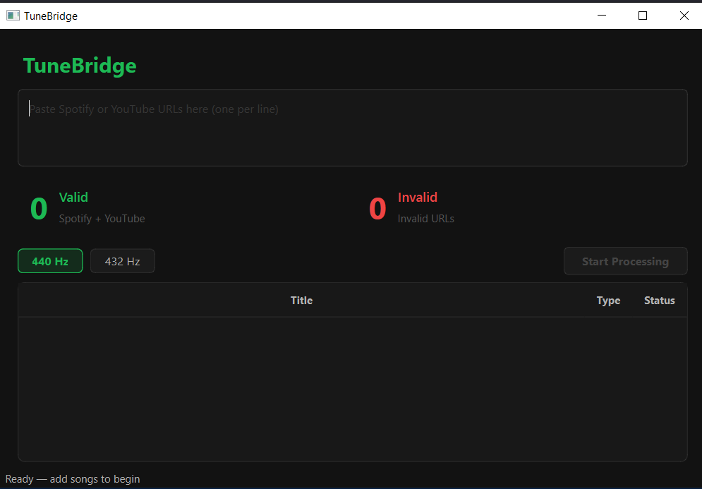

# TuneBridge

A desktop app that takes Spotify or YouTube track URLs, finds the best audio match on YouTube, downloads it, optionally retunes from 440 Hz to 432 Hz, organizes files into your existing folder structure, and uploads them to iBroadcast — all in one automated pipeline.



## Features

- **Dual input** — paste Spotify URLs or YouTube URLs (mixed batches supported)
- **Spotify metadata** — scrapes track title, artist, album, and duration from the public Spotify page (no API key required)
- **YouTube audio matching** — searches YouTube via yt-dlp and picks the best audio-only match using duration and title scoring
- **Batch downloads** — parallel downloads with dynamic thread count based on queue size
- **440 Hz / 432 Hz** — optional pitch retune per batch before saving
- **Folder confirmation** — per-song folder dialog with last-used folder suggestion; app never creates or renames folders
- **iBroadcast upload** — uploads processed files to a configurable playlist with duplicate detection

## Requirements

- Python 3.11+
- [ffmpeg](https://ffmpeg.org/) — must be on `PATH`
- [Node.js](https://nodejs.org/) — required by yt-dlp for YouTube signature solving
- iBroadcast account (for upload step)

## Installation

```bash
git clone https://github.com/Spyro7883/TuneBridge.git
cd TuneBridge
pip install -r requirements.txt
```

Copy `.env.example` to `.env` and fill in your iBroadcast credentials:

```bash
cp .env.example .env
```

```
IBROADCAST_USERNAME=your@email.com
IBROADCAST_PASSWORD=yourpassword
```

## Usage

```bash
python tunebridge.py
```

1. Paste one or more Spotify or YouTube URLs into the input box (one per line)
2. Select **440 Hz** or **432 Hz** for the batch
3. Click **Start Processing**
4. Confirm the destination folder for each song as it completes
5. Click **Upload to iBroadcast** when ready

## Configuration

| Variable | Description |
|----------|-------------|
| `IBROADCAST_USERNAME` | iBroadcast account email |
| `IBROADCAST_PASSWORD` | iBroadcast account password |

The iBroadcast upload step is skipped silently if credentials are not configured.

## Tech Stack

| Component | Library |
|-----------|---------|
| GUI | PySide6 |
| YouTube download | yt-dlp |
| Audio retune | librosa, soundfile |
| Audio processing | ffmpeg, numpy |
| Metadata scraping | requests (Spotify public page) |
| ID3 tagging | mutagen |

## Notes

- The app scrapes Spotify's public page for metadata — no Spotify API key or Premium account needed
- yt-dlp requires Node.js to solve YouTube's signature challenges; keep both up to date
- Folders must already exist on disk; the app will not create them

## Disclaimer

TuneBridge is provided **for personal use only**. The user is responsible for ensuring their use of the app complies with all applicable terms of service and local laws:

- **YouTube Terms of Service** restrict downloading content; use this tool only for content you have the right to download (e.g. your own uploads, Creative Commons material, or where YouTube provides a download button).
- **Spotify** metadata is scraped from public pages — no account is required and no Spotify API credentials are used.
- **iBroadcast** uploads are made via the official API using your own account credentials.

This project is **not affiliated with, endorsed by, or sponsored by** Spotify, YouTube, Google, or iBroadcast. All trademarks are the property of their respective owners.

The author accepts no responsibility for misuse. If you are unsure whether your intended use is permitted, do not use this tool.

## License

MIT
